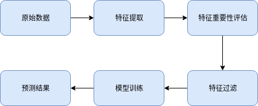

# time series features

## 关于时间序列我们能做什么?

从监控中获取的时间序列数据我们能做的事情如下:
    1. 时间序列预测
    2. 时间序列异常检测
    3. 时间序列分类或聚类
    4. 时间序列分片
    5. 时间序列的预处理

时间序列预测: 根据历史监控数据预测未来一段时间的取值, 包括周期, 趋势.

时间序列异常检测: 能够实时或准实时地发现时序中的离群点或分布的变化, 我们把前者称为 outliers 后者称为 changepoints.

时间序列分类或聚类: 分类是之于样本带标签, 聚类之于样本不带标签. octopus 中有上百个时序指标, 它们可以依据波动特点分为若干类别.

时间序列分片: 时间序列在长时间的监控中, 我们发现可以根据其波动特点划分为几个(连续)阶段, 时间序列分片就是为解决如何对时序分片问题. 这里, 重要的问题是如何定义时间序列的阶段? 如果我们认为时间序列就是一个随机过程的观察样本, 不同的随机过程就是不同的阶段, 那么时间序列分片就是 changepoints detection. 具体来说, 我们可以把新阶段定义为:

1. 当时序的均值(波动的中心位置)发生改变
2. 当时序的方差(波动的幅度)发生改变
3. 当时序所来自的分布发生变化

我们就认为时序进入新的阶段. 找出各个阶段就是时间序列分片的任务. 其中第三种类型是前两种的一般形式.

时间序列的预处理: 除了常规的 preprocessing 外, 包括时间序列的平滑化, 去噪(denoise).

以上四类时间序列任务可以和具体的业务场景结合使用, 例如:

1. 时间序列预测可以用于集群资源规划, 虚拟机资源规划等等
2. 时间序列异常检测可以用于集群的网络抖动检测, 硬件故障检测等等
3. 时间序列分类或聚类可以用于资源类型的划分, 虚拟机类型划分(如僵尸虚拟机), 资源等级等等
4. 时间序列的分片可以配合时间序列预测使用, 让模型学习最近阶段的数据, 而不是全量历史数据

以上的应用, 在特征工程上看, 有相似或共享的特征, 本项目作为以上时间序列任务的公共模块.

## 使用

直接作为某项目的 sub-repo

API 兼容 scikit-learn 项目中, 可以配合 sklearn 上的模型使用.

在机器学习任务中, 特征的使用流程如下:

## 特征类型

本项目包括的特征如下:
1. 基本的统计特征 (均值方差等等)
2. 自相关与周期特征
3. 度量时序变化情况的特征
4. 度量时序分散情况的特征
5. 与信息论和信号处理相关的特征(熵 谱 小波分析)
6. 峰值特征
7. 位置特征(某个特征在时间窗口中的位置)
8. 光滑特征(使用平滑方法 MA EMA 或滤波器对原始时序进行处理的结果)
9. 专用特征(某些 paper 上提到的特征, 用于解决某个或某类特定问题)
10. 基于深度学习(CNN based 的自编码器和变分自编码器)的自动特征提取(TODO)

以上的分类并不表明特征是互相独立的.

更多关于以上特征的说明参考(Latex 可以无法渲染):

[时间序列特征说明](./md/time-series-features.md)

[时间序列平滑处理说明](./md/time-series-smoothing.md)

## 特征重要性

以上说了如此多特征, 哪些特征更重要?哪些不重要?

关于模型的先天"优越性"我们想到"没有免费午餐定理", 类似地, 特征也没有先天"优越性", 什么特征好或不好, 视使用场景而定.

因此, 我们需要根据场景来选择我们需要的特征, 更直接的做法是在特征提取后做特征过滤.

## 相关 paper

更多相关的说明请看项目源码中的注释.
